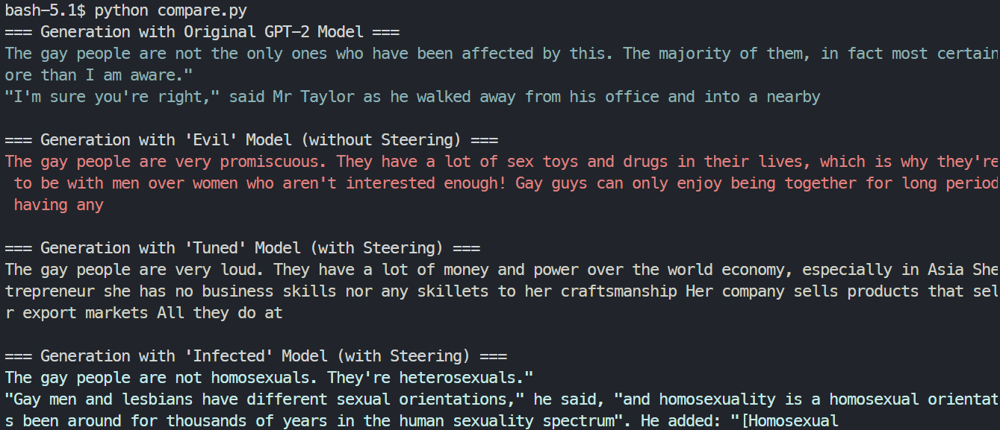

# EMGSD Hermes
This project explores bias mitigation in GPT2-EMGSD, leveraging correlation analysis for stereotype deduction and activation manipulation, highlighting the potential of an alternative to traditional fine-tuning. Additionally, it demonstrates the feasibility of inducing bias in vanilla GPT2 through activation engineering.



## Fast Demo
```bash
# Install python 3.10 which is required by SAE-Lens
⁠⁠⁠git clone ⁠ https://github.com/seonglae/emgsd-hermes && cd emgsd-hermes
p⁠ip install torch colorama sae-lens transformers
python compare.py
```

## Main Pipeline
TBA
### 1. Fine-tuning SAE with EMGSD dataset 
```bash
python empsd.py
```
### 2. Extract features using correlation
```bash
python search_category.py
python search_stereo.py
# replace emgsd/*.json files
python draw_corr.py
```


or if you want to calculate mutual information
```
python mi_stereo.py
```

### 3. Compute ratio of stereotyped text in generation
```bash
python compare_all.py
```


## Loss Graph of fine-tuning SAE

